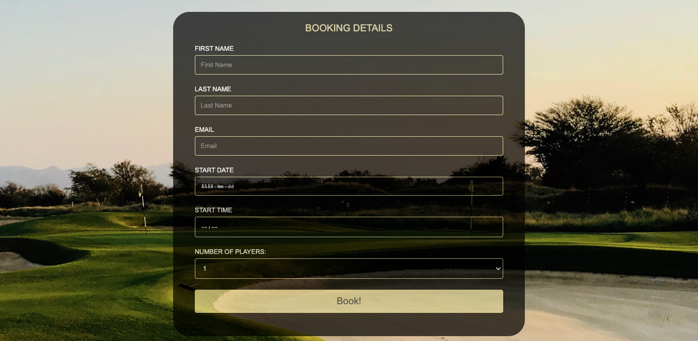

<h1 align="center">Los Naranjos Golfclub Homepage</h1>

This website is the homepage for a golfclub called Los Naranjos in southern Spain. The main goal for this website is to inspire both new and active golfers to play at the club and for the club to be able to effectively market itself online and showcase its various options of amenities, accommodations and practice areas towards those who are interested to play golf. It also has the convenience built in so that golfers can make their reservation and book a start time by themselves online.  

[View the live website here.](https://erikhgm.github.io/Golfclub-homepage/index.html)

## User Experience (UX)

-   ### User stories

    -   #### First Time Visitor Goals
        As a first time visitor I expect to find basic information about the length etc of the golfcourse at Los Naranjos.  
        As a first time visitor I expect to find information about what type of amenities and facilities the club offers.  
        As a first time visitor I expect to find information about the adress and opening hours of the club.  
        As a first time visitor I want to easily find what I am looking for and be able to navigate quickly throughout the site.

      
    -   #### Returning Visitor Goals
        As a returning user I expect to be able to connect with the club on social media so that I can stay updated on what is happening at the club.

        

    -   #### Frequent User Goals
        As frequent user I expect to easily make a reservation for my next round at the golfcourse. 

        

-   ### Design
    - Color Scheme  
    For the color scheme I decided to go with the below colors which focus on elegance and exclusivity which is how the club aims to market itself to its intended target audience.     
    #DBCE8C
    #6E6434
    #1F1F1F 

      

    - Typography  
    The main font used throughout the site for text is the font Kalam, with a fallback font of Cursive in case the font isn't imported correctly for any reason. The Kalam font is appealing and attractive looking font that matches well with the Charm font used for the logotype.

         

        
    - Imagery  
        The imagery has been carefully chosen in order to serve the purposes of both describing how the venue looks like and at the same time inspire new and current golfers to visit and start playing at the club. 
   

## Existing Features

- ### Header and Navigation Bar
    - The header and navigation bar is featured on all three pages for easy navigation and is fully responsive. It is also sticky on top of the page at all times which add to the ease of use in that you do not have to scroll back up to find the navigation links. It includes links to the Home page, Facilities page and the Booking page.
    - The transparent design provides a touch of a premium feel to it which is how the golfclub aims to market itself to its target audience. 

- ### Landing page image
    - When the customers enter the site this section is the first part of the website that will grab their attention. It shows an example of how one of the courses looks like with its beautiful scenery.
    - The hero image provides an inspiring and motivating introduction and it is important for the club to inspire its visitors in order to increase the customerbase.

- ### Welcome sign
    - The Welcome sign encourage the user to keep scrolling down the page and welcomes the user in a nice way. 
    - It incorporates a premium design in order to attract the target audience in mind. 

- ### Club information section
    - The club info section provides the most important information to the user in a quick and easy way. 
    - It includes information that you as a golfer is interested in, such as the various facilities at the club, the length and difficulty of the course. Beautiful images illustrates the information and provide even more inspiration to the user. 

- ### Link boxes
    - The link boxes provides extra motivation and curiosity for the users to continue to explore the other pages of site.
    - The links are interactive and expand when the user hovers over them to make them more engaging for the user. 

- ### The Footer
    - The Footer includes all the social networks links that belongs to the golfclub. They will open in a new tab for easy navigation. 
    - The links play an important part in order to increase the fanpage in socal media sites and create value for the user to stay connected to the club.

- ### The Facilities page
    - In the Facilities page the user can see more information about the various facilities that the club offers.
    - Pictures included provide a good overview and feel for the atmosphere at the club.

- ### The Booking page
    - Here the user is able to conveniently book a start time at the course if they decided to play. For the user this is of good value as they do not need to manually contact the club in order to book a time.
    - For the club it potentially increases the amount of players that play on the course. 

## Technologies Used

### Languages Used
 - [HTML5](https://en.wikipedia.org/wiki/HTML5)
 - [CSS3](https://en.wikipedia.org/wiki/Cascading_Style_Sheets)

### Frameworks, Libraries & Programs Used
 - [Google Fonts:](https://fonts.google.com/)
    - Used for all fonts throughout the website by import to the style.css file.
 - [Font Awesome:](https://fontawesome.com/)
    - Is used for the social media icons in the footer on all pages. 
 - [Git](https://git-scm.com/)
    - Git was used for version control through the Gitpod terminal to commit and push to GitHub
 - [GitHub:](https://github.com/)
     - Was used for all storing and backup of the code pertaining to the project. 

## Testing
-   [W3C Markup Validator](https://jigsaw.w3.org/css-validator/#validate_by_input) 
    - No errors or warnings was shown - [Results](https://validator.w3.org/nu/?doc=https%3A%2F%2Ferikhgm.github.io%2FGolfclub-homepage%2Findex.html)

-   [W3C CSS Validator](https://jigsaw.w3.org/css-validator/#validate_by_input) 
    - No errors or warnings was shown - [Results](https://jigsaw.w3.org/css-validator/validator?uri=https%3A%2F%2Ferikhgm.github.io%2FGolfclub-homepage%2Findex.html&profile=css3svg&usermedium=all&warning=1&vextwarning=&lang=sv)

- [Adobe Color](https://color.adobe.com/create/color-contrast-analyzer)
    - The font color combinations were tested with Adobe color to check contrast levels for accessibility purposes.

### Testing User Stories from User Experience (UX) Section

-   #### First Time Visitor Goals
    -   As a first time visitor I expect to find basic information about the length etc of the golfcourse at Los Naranjos.  
        -   Upon entering the site, the user will directly be able to see the most important information about the course in the club info box section on the main page. 
    -   As a first time visitor I expect to find information about what type of amenities and facilities the club offers.  
        - When the user enters the site, the information about the club and its amenities and facilities is displayed immediately to the user in the club info box section.  
        - The information is available to the user without having to click on a link to go to a different page to find the information.
        - For more in depths information the user can click on the facilities link, or scroll to the image links and go to the information page. 
    -   As a first time visitor I expect to find information about the address and opening hours of the club.  
        -  It is expected for this kind of information to be found in the footer by the users. The user can scroll down to the footer section of the page and find the related information about the club. 
    -   As a first time visitor I want to easily find what I am looking for and be able to navigate quickly throughout the site.
        - The layout of the website is planned so it is easy and quick to find information and to navigate throughout the pages.
        - The header sticks to the top of the page so that the navigation bar is visible at all times.

-   #### Returning Visitor Goals
    - As a returning user I expect to be able to connect with the club on social media so that I can stay updated on what is happening at the club.
        -   As a returning visitor interested in connecting more with the club, the user can navigate to the social media links that opens a new tab. The social media section includes links to the club's fanpage on Facebook, Twitter, Instagram and Youtube.

    

-   #### Frequent User Goals
    - As frequent user I expect to easily make a reservation for my next round at the golfcourse. 
        -   When entering the site, users can easily navigate to the booking page in just on click and fill out their booking information. 

### Further Testing
-   The website has been thoroughly tested on different browsers including Google Chrome, Internet Explorer, Safar and Microsoft Edge.
-   Extensive testing was performed to make sure all the links and navigation work properly.
-   Testing on different devices to make sure it scales properly using the below tools:
    -   [Responsivetesttool](http://responsivetesttool.com/)
    -   [Google Devtools](https://developer.chrome.com/docs/devtools/open/)

### Known Bugs
|Bug | Solution | Status |
|----|:---------|:-------|
|Images in the Facilities page covered the text| Add the height property to each image instead of the class | Fixed |
|Images in the linkboxes on main page not scaling correctly| Add the image as background instead | Fixed |
|Headings in the linkboxes on main page not scaling correctly on small devices| Reduced font size for small devices | Fixed | 
|The submit button and select field not having the same width as the other input fields| Add box-sizing property to input and submit selector| Fixed |
|Images in the linkboxes on main page overlow: hidden not working correctly| Add a container div and set to overflow: hidden | Fixed |

## Deployment

### GitHub Pages
For deployment of the project, I used GitHub Pages by following the below steps:

1. Go to [the project repository](https://github.com/ErikHgm/Golfclub-homepage)
2. Click the "Settings" button on the menu inside the repository.
3. Click the "Pages" button on the left hand menu.
4. In the dropdown menu in the Source section, select the Main branch.
5. Now the page will refresh automatically.
6. Wait until the link above the source section shows "Your site is published at (URL)". 

### Forking the GitHub Repository
1. Go to [the project repository](https://github.com/ErikHgm/Golfclub-homepage)
2. In the right most top menu, click the "Fork" button.
3. There will now be a copy of the repository in your own GitHub account.

### Running the project locally
1. Go to [the project repository](https://github.com/ErikHgm/Golfclub-homepage)
2. Click on the "Code" button.
3. Choose one of the three options (HTTPS, SSH or GitHub CLI) and then click copy.
4. Open the terminal in you IDE program. 
5. Type `git clone` and paste the URL that was copied in step 3.
6. Press Enter and the local clone will be created. 

#### Alternatively by using Gitpod:
1. Go to [the project repository](https://github.com/ErikHgm/Golfclub-homepage)
2. Click the green button that says "Gitpod" and the project will now open up in Gitpod.

## Credits

### Code
- The zoom effect on hover for the imagelinks on the frontpage comes from [W3Schools](https://www.w3schools.com/cssref/css3_pr_transform.asp)

### Content
- The text on the front page infoboxes was written by myself.
- The text in the facilities page comes from the website of the [Los Naranjons golfclub](https://losnaranjos.com/en/).
- The name and contact information comes from the website of the [Los Naranjons golfclub](https://losnaranjos.com/en/). 

### Media
- The images in the facilities page comes from the website of the [Los Naranjons golfclub](https://losnaranjos.com/en/)
- The right image in the front page infoboxes section comes from the website of the [Los Naranjons golfclub](https://losnaranjos.com/en/).
- The rest of the images on the front page comes from [Unsplash](https://www.unsplash.com) 
- The background image in the booking page comes from [Unsplash](https://www.unsplash.com) 

### Acknowledgements
I would like to thank: 
- The tutor support team att Code Institute for their support.
- My Code Institute Mentor for feedback and suggestions.

